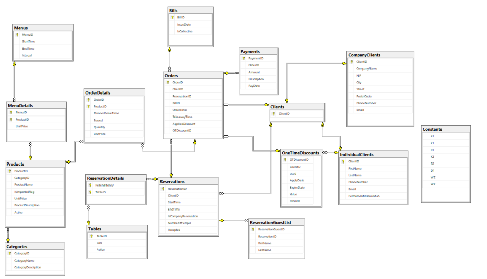

# Restaurant-DataBase
DataBase done with @Yonell and @dominikpuz.
The repository contains a collection of procedures, functions, DDL commands, and triggers necessary for creating and managing a database.
The scheme of our database you can find below

